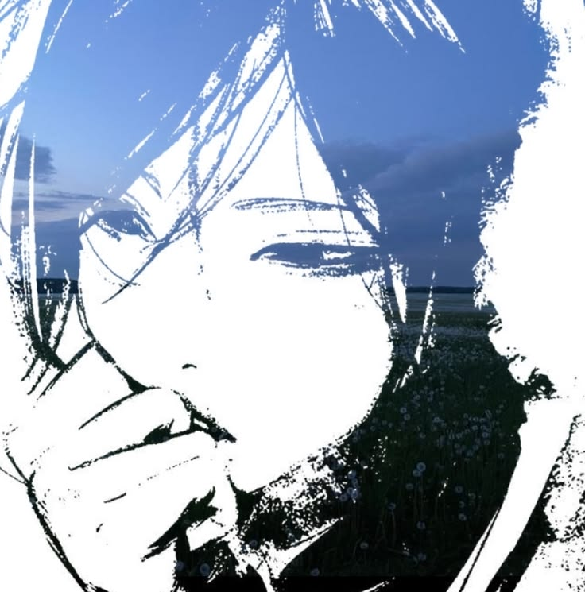

 

 

### nicelynn0 (paul only ;P)

*in my bissmillah 'n wallahualam era* 🦊

 

---

## 🛠️ My Tech Stack

---

## 💻 What I Like to Do

🎨 **Design** → making things look pretty  
 
💻 **Code** → turning ideas into websites  
 
🐛 **Debug** → wondering why it doesn't work  
 
✨ **Learn** → trying again until it works  

---

## 🔥 My Coding Streak

---

### 💌 Thanks for visiting!

 
byeee🙂‍↕️

